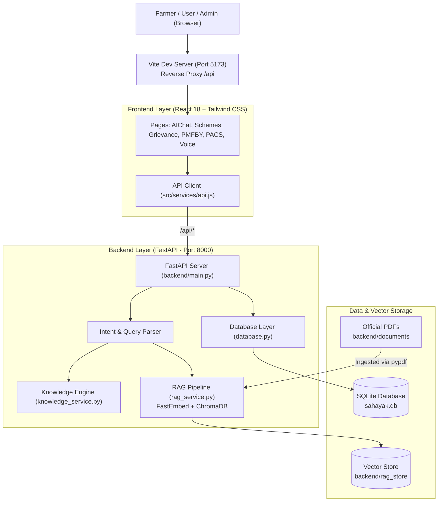

# Sahayak AI (सहायक AI) 🌾
> **Empowering Indian Farmers & Rural Cooperatives with Grounded AI Assistance, Knowledge Retrieval, and Grievance Support**

Sahayak AI is a full-stack, AI-powered agricultural and cooperative intelligence platform tailored for Indian farmers, Primary Agricultural Credit Societies (PACS), and rural community members. The platform bridges the information divide by offering multilingual guidance on government agricultural schemes (e.g., PMFBY, PM-KISAN), cooperative governance laws, crop loss intimation workflows, and grievance complaint drafting.

---

## 📑 Table of Contents
- [Key Features](#-key-features)
- [System Architecture](#-system-architecture)
- [Technology Stack](#-technology-stack)
- [Project Directory Structure](#-project-directory-structure)
- [Prerequisites](#-prerequisites)
- [Quick Start Guide](#-quick-start-guide)
  - [1. Backend Setup (FastAPI & SQLite)](#1-backend-setup-fastapi--sqlite)
  - [2. Frontend Setup (React & Vite)](#2-frontend-setup-react--vite)
- [API Endpoints](#-api-endpoints)
- [Database Schema](#-database-schema)
- [RAG & Knowledge Base Engine](#-rag--knowledge-base-engine)
- [Running Tests](#-running-tests)
- [Prototype Disclaimer](#-prototype-disclaimer)

---

## ✨ Key Features

### 1. 🤖 Grounded AI Chat Assistant (RAG-Powered)
- Semantic question answering on agricultural policies, crop insurance, and cooperative bylaws.
- Grounded in official government documents and circulars with source citations to prevent hallucinations.
- Multilingual query handling (English, Hindi, and regional language support).
- Automatic persistence of conversation logs linked to user accounts.

### 2. 🎙️ Farmer-Friendly Voice Interface
- Voice-first interface simulated for hands-free operation in agricultural fields.
- Pre-configured common voice queries (KCC interest rates, subsidized fertilizer acquisition, PMFBY claims).

### 3. 🔍 Smart Scheme Finder
- Filter and search central and state government agricultural schemes by beneficiary type (*Farmer, Cooperative Member, PACS, Agri-entrepreneur*), state, and category.
- Direct links to eligibility criteria, official application portals, and subsidy benefits.

### 4. 🛡️ PMFBY Crop Insurance & 72-Hour Claim Guide
- Clear step-by-step instructions on intimation timelines (critical 72-hour window for post-harvest / localized losses).
- Document checklist (Khasra/Khatauni, sowing certificate, bank passbook, Aadhaar).
- Direct access to national toll-free helplines (14447) and the Crop Insurance App.

### 5. 🏛️ PACS Services & Cooperative Laws
- **PACS Hub:** Information on subsidized fertilizer distribution (IFFCO via POS verification), certified seed distribution, and PACS computerization initiative.
- **Cooperative Laws:** Plain-language guides to the Multi-State Co-operative Societies (MSCS) Act, member rights, annual general meeting (AGM) rules, and audit requirements.

### 6. 📝 AI Grievance Redressal & Letter Generator
- Categorized guidance for unresolved crop insurance claims, fertilizer hoarding, or credit access delays.
- Generates structured, formal complaint letter drafts ready for manual submission to relevant grievance authorities (CPGRAMS, State Cooperative Registrars, or Insurance Ombudsmen).

### 7. 📊 Admin & Document Intelligence Dashboard
- Analytics on registered beneficiaries, query volumes, and grievance categories.
- Management interface for ingested policy documents, knowledge vectors, and system status.

---

## 🏛️ System Architecture



---

## 💻 Technology Stack

### Frontend
- **Framework:** React 18 (SPA)
- **Build Tool:** Vite 6
- **Styling:** Tailwind CSS 3 with PostCSS and Autoprefixer
- **Icons:** Lucide React
- **Routing:** React Router DOM 6

### Backend
- **Framework:** FastAPI (Python 3.11+)
- **Server:** Uvicorn ASGI Server
- **Data Validation:** Pydantic v2
- **Database:** SQLite 3 with strict foreign key constraints (`PRAGMA foreign_keys = ON`)

### AI & Retrieval-Augmented Generation (RAG)
- **Vector Database:** ChromaDB
- **Embedding Generation:** FastEmbed (`BAAI/bge-small-en-v1.5`)
- **Document Processing:** PyPDF for parsing official government policy guidelines

---

## 📁 Project Directory Structure

```text
Sahayak_AI/
├── backend/
│   ├── documents/             # Official government PDFs (PMFBY, PM-KISAN guidelines)
│   ├── knowledge/             # Structured policy & scheme JSON knowledge files
│   │   ├── cooperative.json
│   │   ├── financial.json
│   │   ├── pacs.json
│   │   └── pmfby.json
│   ├── rag_store/             # ChromaDB persistent vector database
│   ├── services/
│   │   ├── intent_service.py  # Query classification & keyword matching
│   │   ├── knowledge_service.py # Curated responses, grievances, & letter drafting
│   │   └── rag_service.py     # Document chunking, FastEmbed indexing, semantic search
│   ├── database.py            # SQLite schema initialization and CRUD queries
│   ├── main.py                # FastAPI entry point, routing, and CORS middleware
│   ├── models.py              # Pydantic schemas and database models
│   ├── schemas.py             # Request & response validation models
│   ├── sahayak.db             # Local SQLite database file
│   └── requirements.txt       # Python backend dependencies
│
├── src/
│   ├── components/            # Reusable UI components (Button, Card, VoiceButton, Topbar, Sidebar)
│   ├── data/                  # Mock fallback data for offline mode
│   ├── layouts/               # DashboardLayout with responsive navigation
│   ├── pages/                 # Full feature views:
│   │   ├── AIChat.jsx         # Conversational assistant interface
│   │   ├── AdminDashboard.jsx # Admin metrics & document management
│   │   ├── CooperativeLaws.jsx# Multi-State Cooperative Society guidance
│   │   ├── Dashboard.jsx      # Beneficiary overview dashboard
│   │   ├── FinancialLiteracy.jsx # KCC loans, SHGs, interest subvention
│   │   ├── Grievance.jsx      # Complaint guidance & draft letter generator
│   │   ├── Landing.jsx        # Landing page
│   │   ├── LanguageSelection.jsx # Multilingual selection
│   │   ├── PACSServices.jsx   # Subsidized fertilizer, seeds, & credit society info
│   │   ├── PMFBY.jsx          # Crop insurance claims & 72-hour guide
│   │   ├── Profile.jsx        # Farmer profile & landholding details
│   │   ├── SchemeFinder.jsx   # Filterable government schemes search
│   │   └── VoiceAssistant.jsx # Voice interaction simulator
│   ├── services/
│   │   └── api.js             # Unified frontend API client with local fallback
│   ├── App.jsx                # Main application routing
│   ├── index.css              # Global styles & Tailwind directives
│   └── main.jsx               # React DOM entry point
│
├── index.html                 # HTML shell with Google Fonts & responsive viewport
├── package.json               # Node.js project manifest & scripts
├── tailwind.config.js         # Tailwind theme configuration
├── vite.config.js             # Vite configuration with /api reverse proxy
├── test_database.py           # Unit & integration tests for SQLite database layer
├── test_backend.py            # End-to-end HTTP API tests for backend endpoints
├── download_official_docs.py  # Utility script to download official government PDFs
└── validate_official_docs.py  # PDF integrity and magic-bytes validation script
```

---

## ⚙️ Prerequisites

Before running the application locally, ensure you have the following installed:
- **Python:** Version 3.10, 3.11, or 3.12 (`python --version`)
- **Node.js:** Version 18.x, 20.x, or 24.x (`node -v`)
- **Package Manager:** `npm` (Windows users: run `npm.cmd` if PowerShell script execution is restricted)

---

## 🚀 Quick Start Guide

### 1. Backend Setup (FastAPI & SQLite)

1. Open a terminal and navigate to the `backend/` directory:
   ```bash
   cd backend
   ```

2. Create and activate a Python virtual environment (optional but recommended):
   ```bash
   python -m venv venv
   # On Windows (PowerShell/CMD):
   .\venv\Scripts\activate
   # On Linux/macOS:
   source venv/bin/activate
   ```

3. Install required Python packages:
   ```bash
   pip install -r requirements.txt
   ```

4. Start the FastAPI development server:
   ```bash
   python -m uvicorn main:app --host 0.0.0.0 --port 8000 --reload
   ```

5. Verify the backend is running:
   - **Backend Status Dashboard:** [http://localhost:8000/](http://localhost:8000/)
   - **Health Check:** [http://localhost:8000/api/health](http://localhost:8000/api/health)
   - **Interactive Swagger Docs:** [http://localhost:8000/docs](http://localhost:8000/docs)

---

### 2. Frontend Setup (React & Vite)

1. Open a new terminal in the project root directory (`Sahayak_AI/`):
   ```bash
   cd Sahayak_AI
   ```

2. Install dependencies:
   ```bash
   npm install
   # Windows PowerShell users can use: npm.cmd install
   ```

3. Start the Vite development server:
   ```bash
   npm run dev
   # Windows PowerShell users can use: npm.cmd run dev
   ```

4. Open your browser and navigate to:
   ```
   http://localhost:5173/
   ```

> **Note:** The Vite development server automatically proxies all `/api` requests to `http://127.0.0.1:8000`, so no CORS configuration is required.

---

## 🔌 API Endpoints

| Method | Endpoint | Description |
| :--- | :--- | :--- |
| `GET` | `/` | Backend landing dashboard with service health status |
| `GET` | `/api/health` | Health check returning `{"status": "ok", "service": "Sahayak AI"}` |
| `POST` | `/api/chat` | Send a query to the AI assistant (returns grounded answer + source citation) |
| `GET` | `/api/chat/history` | Retrieve persistent chat conversation logs for a user |
| `GET` | `/api/schemes` | Fetch all agricultural and cooperative government schemes |
| `POST` | `/api/schemes/search` | Filter schemes by `user_type`, `requirement`, and `state` |
| `GET` | `/api/pmfby` | Retrieve PMFBY operational guidelines, deadlines, and claim rules |
| `GET` | `/api/pacs` | Retrieve PACS services, fertilizer distribution rules, and credit info |
| `GET` | `/api/cooperative` | Query cooperative laws, compliance criteria, and MSCS guidelines |
| `GET` | `/api/financial` | Fetch financial literacy information (KCC rates, SHGs, bank safety) |
| `POST` | `/api/grievance/guidance` | Get immediate next steps, required documents, and official escalation channel |
| `POST` | `/api/grievance/draft` | Generate a structured complaint letter draft and record grievance in DB |
| `GET` | `/api/grievances` | List all filed or drafted grievances |
| `GET` | `/api/users/demo` | Retrieve pre-seeded demo user record |
| `GET` | `/api/documents` | List indexed official policy documents in the system |

---

## 🗄️ Database Schema

The database (`backend/sahayak.db`) is managed via SQLite with relational integrity enforced on startup:

### 1. `users`
- Stores user profile information, roles (*farmer*, *cooperative_member*, *admin*), state, and contact details.

### 2. `chat_history`
- Records every query submitted by users, the generated answer, language, and timestamp, with a foreign key referencing `users(id)`.

### 3. `schemes`
- Contains curated central and state agricultural schemes including eligibility, benefits, application steps, and official portal URLs.

### 4. `documents`
- Metadata for policy circulars and operational guidelines ingested into the RAG vector index.

### 5. `grievances`
- Tracks grievance drafts generated by users, categorization, problem description, status (*draft*, *submitted*), and creation dates.

---

## 🧠 RAG & Knowledge Base Engine

The retrieval and response pipeline combines:
1. **Document Ingestion (`backend/services/rag_service.py`):**
   - Automatically parses PDFs from `backend/documents/` using `pypdf`.
   - Splits text into overlapping semantic chunks.
   - Generates vector embeddings locally using FastEmbed (`BAAI/bge-small-en-v1.5`).
   - Stores embeddings into a persistent ChromaDB collection in `backend/rag_store/`.
2. **Google Gemini LLM Generation (`backend/services/llm_service.py`):**
   - Uses the official Google GenAI Python SDK (`google.genai`) to generate natural language answers from retrieved context.
   - Grounded via a strict system prompt preventing hallucinations of schemes, rates, deadlines, or legal rules.
   - Secrets (`GEMINI_API_KEY`) remain server-side in `.env` and are never exposed to React or frontend code.
3. **Deterministic Grounded Fallback:**
   - Vector similarity matches context from official guidelines.
   - Fallback to curated structured knowledge files (`backend/knowledge/`) ensures high availability and valid answers even if Gemini is unconfigured or unavailable.


---

## 🧪 Running Tests

The repository includes standalone validation suites for both the database and the end-to-end API:

### 1. Test Database Layer
Verifies table schemas, foreign key constraints, demo user retrieval, chat persistence, and scheme queries:
```bash
python test_database.py
```

### 2. Test End-to-End Backend APIs
Validates that all FastAPI endpoints are responding correctly with valid payloads:
```bash
# Ensure the backend server is running on port 8000 first:
python test_backend.py
```

### 3. Validate Policy Documents
Checks that all downloaded official PDF guidelines have intact headers:
```bash
python validate_official_docs.py
```

---

## ⚠️ Prototype Disclaimer

Sahayak AI is an informational decision-support and guidance prototype developed for educational, demonstration, and research purposes.
- Information provided regarding government schemes, insurance claims, and legal provisions is synthesized from public government guidelines.
- **Important legal, financial, and government service matters should always be verified directly with the official authority**, such as the Ministry of Agriculture & Farmers Welfare, Ministry of Cooperation, or official portals ([pmfby.gov.in](https://pmfby.gov.in), [pmkisan.gov.in](https://pmkisan.gov.in)).
- This prototype does **not** directly lodge complaints to government portals; it assists beneficiaries in understanding procedures and drafting their letters for manual submission.
